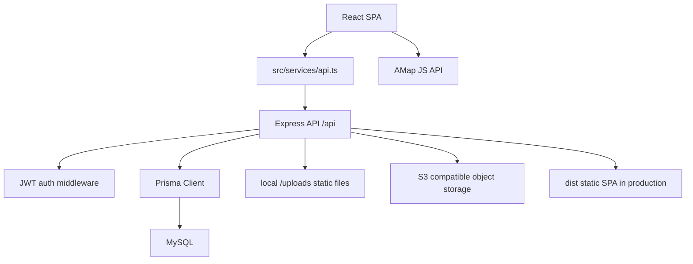

# Sweet Love 项目分析文档

更新时间：2026-05-20

## 1. 项目概览

Sweet Love 是一个面向情侣的私密生活记录应用，核心目标是把两个人的纪念日、日记、相册、愿望清单、留言、每日评分、点餐和厨房内容串在一起。

当前项目是一个前后端同仓应用：

- 前端使用 React 19、Vite 6、TypeScript、Tailwind CSS 4、motion 和 lucide-react。
- 后端使用 Express 4，开发环境挂载 Vite middleware，生产环境托管 `dist` 前端构建产物。
- 数据持久化使用 Prisma + MySQL，结构由 `prisma/schema.prisma` 和 `prisma/migrations` 管理。
- 登录鉴权使用 bcryptjs 加密密码，jsonwebtoken 签发 7 天有效期 token。
- 上传文件支持本地目录和 S3 兼容对象存储，由 `STORAGE_DRIVER` 控制。
- 地图功能基于高德地图 JS API，用于相册地点选择和足迹地图。

项目已经具备可部署的小型产品形态，包含账号体系、情侣绑定、业务数据隔离、文件上传、地图能力、数据库迁移和生产部署文档。

## 2. 技术栈

| 层级 | 技术 |
| --- | --- |
| 前端框架 | React 19、Vite 6、TypeScript |
| 样式 | Tailwind CSS 4、`src/index.css` |
| 动效 | motion |
| 图标 | lucide-react |
| 后端 | Express 4、tsx |
| 鉴权 | JWT、bcryptjs |
| 数据库 | MySQL、Prisma Client |
| 文件上传 | multer、本地 `/uploads`、S3 兼容对象存储 |
| 地图 | 高德地图 JS API |
| 构建检查 | TypeScript、Vite build |
| 部署建议 | Node.js、MySQL、Nginx、PM2 或 systemd |

## 3. 目录结构

```text
.
|-- server.ts                         # Express API + Vite/静态文件服务
|-- package.json                      # 脚本和依赖
|-- vite.config.ts                    # Vite 配置
|-- tsconfig.json                     # 前端 TS 配置
|-- tsconfig.server.json              # 服务端 TS 配置
|-- prisma
|   |-- schema.prisma                 # Prisma 数据模型
|   `-- migrations                    # 数据库迁移
|-- src
|   |-- App.tsx                       # 应用入口、全局状态、页面切换、数据加载
|   |-- main.tsx                      # React 入口
|   |-- services
|   |   `-- api.ts                    # 前端 API client
|   |-- types.ts                      # 前端类型定义
|   |-- lib
|   |   |-- amap.ts                   # 高德地图 key/security 配置
|   |   `-- utils.ts                  # 通用工具
|   |-- server
|   |   |-- config.ts                 # 服务端环境变量读取
|   |   |-- db.ts                     # Prisma client
|   |   |-- routes.ts                 # API 路由
|   |   `-- middleware
|   |       `-- auth.ts               # 鉴权中间件
|   |-- components                    # 通用组件
|   |-- hooks                         # React hooks
|   `-- pages                         # 业务页面
`-- docs
    |-- startup.md                    # 本地启动文档
    |-- linux-deployment.md           # Linux 生产部署文档
    `-- project-analysis.md           # 当前文档
```

## 4. 运行方式

本地开发：

```bash
npm install
cp .env.example .env
npm run db:generate
npm run db:dev
npm run dev
```

生产构建：

```bash
npm run db:generate
npm run db:migrate
npm run build
npm start
```

常用环境变量：

- `DATABASE_URL`：MySQL 连接地址
- `JWT_SECRET`：JWT 签名密钥
- `PORT`：服务端口，默认 `3000`
- `STORAGE_DRIVER`：上传存储后端，`local` 或 `s3`
- `UPLOAD_DIR`：本地上传目录，默认 `uploads`
- `MAX_UPLOAD_MB`：单个上传文件最大体积
- `S3_REGION` / `S3_BUCKET` / `S3_ACCESS_KEY_ID` / `S3_SECRET_ACCESS_KEY` / `S3_PUBLIC_URL`：S3 模式必填配置
- `S3_ENDPOINT` / `S3_FORCE_PATH_STYLE`：S3 兼容服务可选配置
- `VITE_AMAP_KEY` / `VITE_AMAP_SECURITY_CODE`：高德地图配置
- `APP_URL`：生产访问地址

## 5. 系统架构



主要流程：

1. 用户进入应用后，`App.tsx` 从 `localStorage` 读取 token。
2. 如果存在 token，调用 `/api/auth/me` 恢复登录态。
3. 未登录时展示 `Auth`，已登录但未绑定情侣时展示 `Binding`。
4. 绑定后加载日记、待办、留言、纪念日、相册、情侣资料、每日评分、点餐和厨房数据。
5. 前端通过 `src/services/api.ts` 调用后端接口，后端通过 Prisma 读写 MySQL。

## 6. 前端功能分析

### 6.1 应用入口

`src/App.tsx` 负责：

- 维护登录用户、情侣关系、当前页面和全局业务数据
- 根据用户是否绑定情侣关系展示 `Binding` 或业务页面
- 在首页、日记、相册、待办、个人页等页面之间切换
- 对留言页进行轮询刷新
- 按页面刷新对应业务数据
- 基于 `window.visualViewport.height` 设置 `--app-height`，优化移动端浏览器底部工具栏遮挡问题

当前路由是手写状态路由，没有使用 React Router。

### 6.2 主要页面

| 页面 | 功能 |
| --- | --- |
| `Auth.tsx` | 登录、注册、保存 token |
| `Binding.tsx` | 展示邀请码、输入对方邀请码完成绑定 |
| `Home.tsx` | 情侣空间、恋爱天数、最近纪念日、待办摘要、每日评分、厨房入口 |
| `Anniversaries.tsx` | 纪念日列表、倒计时、新增、删除、重要标记 |
| `Diary.tsx` | 新增、编辑、删除日记，维护心情、图片和位置 |
| `Album.tsx` | 上传图片/视频、分类筛选、照片墙、时间线、足迹地图、点赞、评论、精选、海报 |
| `AlbumFootprintMap.tsx` | 高德足迹地图、缩略图 marker、聚合点、拖动和缩放 |
| `TodoList.tsx` | 100 件恋爱小事、完成状态、分类筛选、新增、删除、完成回忆 |
| `MessageBoard.tsx` | 聊天气泡、图片留言、自动滚动、轮询刷新 |
| `MenuOrder.tsx` | 菜品库、今日点餐、数量和备注 |
| `CoupleKitchen.tsx` | 菜谱、收藏、购物清单、做饭打卡 |
| `Profile.tsx` | 修改个人资料、情侣资料、头像、封面、解绑、退出 |
| `MapPicker.tsx` | 高德地图选点、搜索、定位和地址反查 |

### 6.3 移动端适配

界面整体是移动端 App 风格，在桌面端以 `max-w-md` 手机壳形式居中展示，在移动端使用完整视口高度。相关实现包括：

- `index.html` 使用 `viewport-fit=cover`
- `src/index.css` 提供 `app-viewport`、`app-shell`、`app-bottom-nav`
- `App.tsx` 写入 `--app-height`，避免手机浏览器工具栏遮挡底部导航

## 7. 后端 API 分析

后端入口是 `server.ts`，业务路由集中在 `src/server/routes.ts`，鉴权中间件位于 `src/server/middleware/auth.ts`。

### 7.1 鉴权与用户

- `POST /api/auth/register`：注册用户，生成邀请码
- `POST /api/auth/login`：登录，返回用户和 token
- `GET /api/auth/me`：根据 token 获取当前用户
- `POST /api/auth/bind`：通过邀请码绑定情侣
- `POST /api/auth/unbind`：解除绑定
- `PUT /api/user/profile`：更新个人资料

鉴权中间件从 `Authorization: Bearer <token>` 解析 token，再通过 Prisma 查询用户。

### 7.2 情侣关系

- `GET /api/couple`：获取当前情侣关系
- `PUT /api/couple`：更新情侣空间名称、简介、封面和开始日期

绑定时会同时更新双方 `partnerId`，并创建 `couples` 记录。

### 7.3 业务数据接口

| 模块 | 接口概览 |
| --- | --- |
| 今日评分 | `GET /api/ratings/today`、`POST /api/ratings` |
| 纪念日 | `GET/POST /api/anniversaries`、`PATCH/DELETE /api/anniversaries/:id` |
| 相册 | `GET/POST /api/album`、`PATCH/DELETE /api/album/:id`、评论、点赞 |
| 日记 | `GET/POST /api/diaries`、`PUT/DELETE /api/diaries/:id` |
| Todo | `GET/POST /api/todos`、`PATCH/DELETE /api/todos/:id` |
| 留言 | `GET/POST /api/messages` |
| 点餐 | 菜品、今日点餐、点餐条目更新和删除 |
| 厨房 | 菜谱、收藏、购物清单、做饭打卡 |
| 上传 | `POST /api/uploads` |

数据读取通常限制为当前用户与情侣双方可见。部分资源以 couple 维度隔离，部分资源以 userId + partnerId 可见性隔离。

## 8. 数据模型

主要模型位于 `prisma/schema.prisma`：

- `User`：用户、邀请码、伴侣关系、头像和简介
- `Couple`：情侣关系、空间资料和开始日期
- `Anniversary`：纪念日
- `AlbumImage`：相册媒体，支持图片/视频、描述、分类、精选、地点、评论和点赞
- `AlbumComment` / `AlbumLike`：相册评论和点赞
- `Diary`：日记、心情、位置和图片
- `Todo`：愿望/待办、完成状态、完成回忆和排序
- `Message`：留言
- `DailyRating`：每日评分
- `MenuDish` / `MealOrderItem`：菜品和点餐
- `KitchenRecipe` / `KitchenRecipeFavorite` / `KitchenShoppingList` / `KitchenCookCheckin`：情侣厨房相关数据

## 9. 文件上传和存储

上传接口使用 `multer` 接收文件。存储由 `STORAGE_DRIVER` 控制：

- `local`：保存到 `UPLOAD_DIR`，由 Express 暴露 `/uploads`
- `s3`：保存到 S3 兼容对象存储，并返回基于 `S3_PUBLIC_URL` 的公开 URL

本地模式适合开发或单机部署；S3 模式更适合生产、多实例和 CDN 场景。

## 10. 当前风险和改进点

### 10.1 路由与状态集中度较高

`App.tsx` 承担了大量全局状态、页面切换和数据刷新职责。后续可拆分：

- 当前用户/情侣上下文
- 各业务模块的数据 hooks
- 页面路由层
- 页面级刷新逻辑

### 10.2 API 路由文件偏大

`src/server/routes.ts` 集中了鉴权、用户、情侣资料、相册、厨房、点餐、日记、留言等接口。随着功能继续增长，建议按模块拆分路由和 service 层。

### 10.3 前端 bundle 可能偏大

应用功能较多，并包含地图和多个业务页面。后续可以考虑：

- 页面级动态 import
- 地图组件懒加载
- 第三方依赖拆包

### 10.4 本地上传需要备份策略

如果生产环境使用 `local` 存储，需要：

- 定期备份 `uploads`
- 迁移服务器时同步 `uploads`
- 多实例部署时避免文件不同步

### 10.5 地图依赖外部配置

地图功能依赖高德地图 key 和安全密钥。生产环境需要确保：

- `VITE_AMAP_KEY` 和 `VITE_AMAP_SECURITY_CODE` 正确
- 高德控制台域名白名单正确
- 站点使用 HTTPS

## 11. 建议迭代路线

### 第一阶段：稳定当前产品体验

1. 检查所有中文文案和文档编码，统一 UTF-8。
2. 给相册、地图、上传和移动端导航补一轮真机验证。
3. 保持 `.env.example` 只放占位符，避免提交真实密钥。
4. 完善上传失败、地图 key 缺失、数据库错误等用户提示。

### 第二阶段：工程拆分

1. 拆分 `src/server/routes.ts` 为模块化路由。
2. 拆分 `App.tsx` 的全局状态和刷新逻辑。
3. 引入页面级 lazy loading，降低首包体积。
4. 为关键 API 增加最小集成测试。

### 第三阶段：部署可靠性

1. 为 `uploads` 增加备份策略，或迁移到对象存储。
2. 增加 PM2 ecosystem 或 systemd 配置样例。
3. 补充数据库备份、恢复和迁移回滚文档。
4. 增加日志和错误监控。

### 第四阶段：产品增强

1. 相册地点支持批量补全和按城市筛选。
2. 纪念日、日记、Todo、厨房增加更完整的编辑体验。
3. 增加数据导出、备份和恢复能力。
4. 增加 PWA 能力，提升手机端沉浸感。

## 12. 总结

Sweet Love 当前已经具备较完整的情侣生活记录产品形态：账号注册登录、情侣绑定、首页、日记、相册、足迹地图、纪念日、100 件小事、留言、点餐和情侣厨房已经串联起来。

工程侧也已经具备 MySQL 持久化、Prisma 迁移、文件上传、Linux 部署和生产构建流程。下一步最值得投入的是稳定性和可维护性：拆分过大的入口和路由文件，优化首包体积，完善上传与地图的生产配置细节，并补充关键路径测试。

